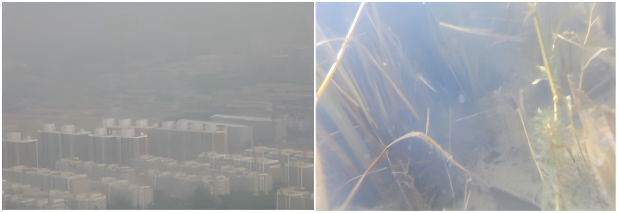

# A Physics-Guided Framework for Underwater Video Enhancement in Aquaculture Environments

This repository provides supplementary information for our work on **underwater video enhancement**.

The purpose of this page is to introduce the motivation behind our research, provide information about the collected underwater video dataset (**IWUV**), and release the revised evaluation metric implementations used in our experiments.

---

# Motivation

Before exploring underwater video enhancement, our research mainly focused on low-light image enhancement.

During this process, we encountered a fundamental question:

> When an image appears degraded, is the visual information truly lost during image acquisition, or is it only hidden by unfavorable illumination conditions?

This question motivated us to rethink image degradation from a different perspective.

Low-light images and underwater images have different degradation mechanisms, but they share several visual characteristics:

- insufficient illumination;
- reduced contrast;
- color distortion;
- invisible or degraded details.

From a visual perspective, both types of images suffer from the same phenomenon:

**The captured image fails to reveal the complete information of the real scene.**

---

# From Haze Removal to Underwater Enhancement

Underwater images and hazy images exhibit remarkable visual similarities.

Both suffer from:

- light scattering;
- contrast attenuation;
- information degradation;
- color distortion.

<p align="center">

</p>

Inspired by classical atmospheric scattering models used in image dehazing, we initially investigated whether haze removal theories could be extended to underwater environments.

However, underwater imaging is more complicated due to:

- wavelength-dependent light attenuation;
- scattering effects;
- unknown transmission information;
- complex underwater illumination.

Most of these physical parameters are difficult to accurately estimate from a single image.

Therefore, instead of explicitly estimating complex physical parameters, we explored underwater degradation from an image decomposition perspective.

---

# Illumination Perspective

Inspired by Retinex theory in low-light enhancement:

\[
S = R \times I
\]

where:

- \(S\) represents the observed image;
- \(R\) represents intrinsic scene reflectance information;
- \(I\) represents illumination information.

We hypothesize that part of underwater degradation can be interpreted as illumination-related degradation.

From this perspective, an underwater image contains:

- intrinsic scene information;
- degradation-related illumination effects.

This viewpoint provides a new way to analyze underwater degradation without requiring inaccessible physical parameters.

---

# Why Underwater Video Enhancement?

Compared with single-image enhancement, underwater video enhancement introduces additional challenges.

A video consists of continuous frames:

```
Frame t-1  →  Frame t  →  Frame t+1
```

A successful underwater video enhancement method should not only improve the visual quality of each individual frame, but also maintain:

- color consistency between adjacent frames;
- temporal coherence;
- reduced flickering artifacts.

Therefore, underwater video enhancement requires both spatial quality improvement and temporal stability.

---

# IWUV Dataset

To investigate real-world underwater degradation, we collected an underwater video dataset:

## IWUV
**Illumination-aware UnderWater Video Dataset**

The dataset was collected from real underwater environments and contains diverse underwater video sequences with different:

- illumination conditions;
- water clarity;
- color degradation levels;
- imaging environments.

The collected videos were processed into continuous frame sequences for underwater video enhancement research.

---

# Dataset Availability

The collected IWUV underwater videos are available through the following link:

**Baidu Netdisk**

```
Link:
https://pan.baidu.com/s/1aDUMFCk1-qVB29uUQ8QeGg

Password:
1234
```

The provided videos are intended for research reference.

---

# Evaluation Metric Revision

During the revision process, we carefully re-examined our experimental evaluation pipeline.

We found that some previous evaluation metric implementations contained inconsistencies.

Therefore, we provide:

- previous evaluation metric implementations;
- corrected evaluation metric implementations;
- scripts for recalculating evaluation results.

The revised evaluation metrics include:

- UCIQE;
- UIQM;
- UICM;
- UISM;
- UIConM.

We hope this update improves the reliability and reproducibility of underwater enhancement evaluation.

---

# Code and Dataset Availability

At the current stage, we provide:

- IWUV underwater video samples;
- revised evaluation metric implementations.

Due to ongoing research, code organization, and dataset refinement, the complete training code and official version of the dataset will be publicly released after paper acceptance.

For research collaboration or reasonable requests, please contact the authors.

---

# Citation

If you find this work useful, please consider citing our paper.

```bibtex
@article{xxx,
  title={xxx},
  author={xxx},
  journal={xxx},
  year={2026}
}
```
